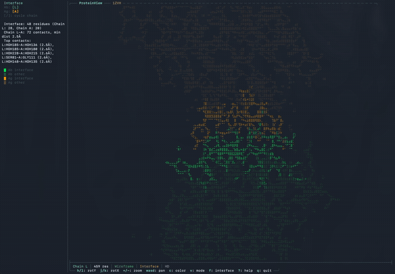
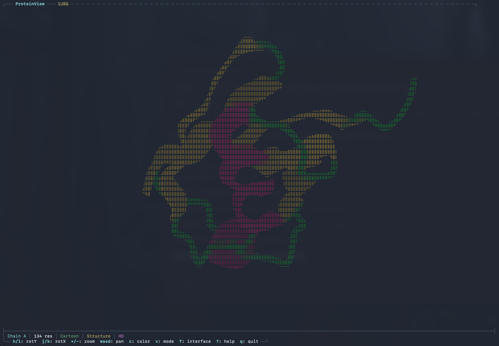
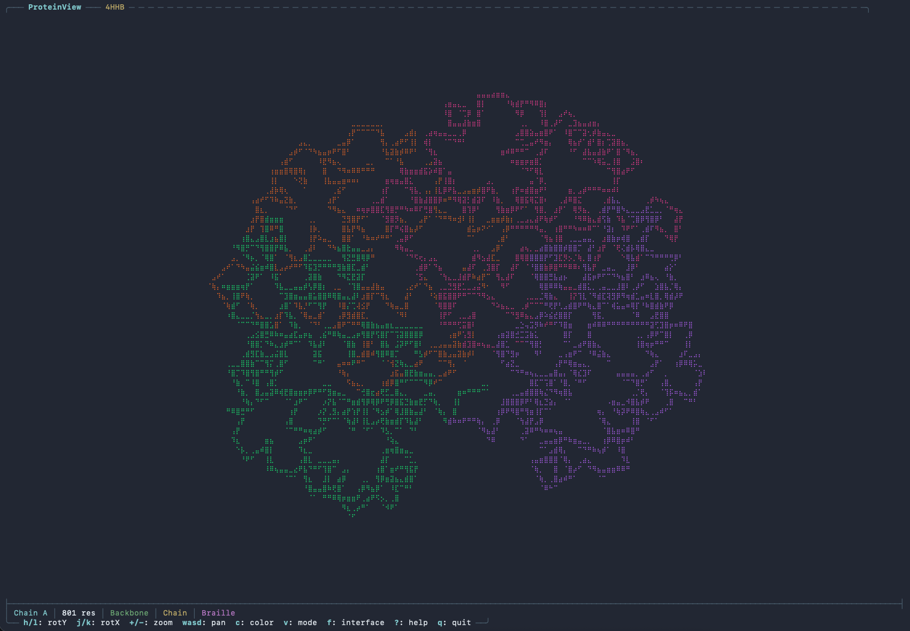
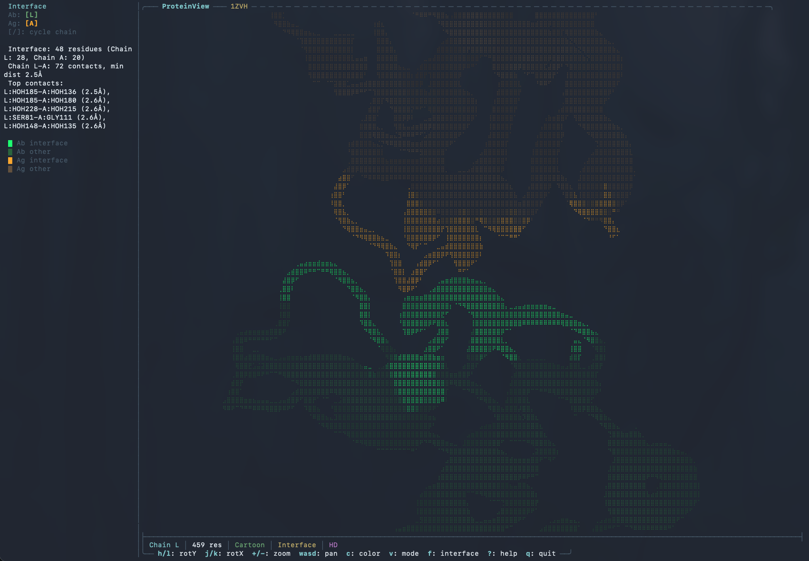

# ProteinView

[](LICENSE)
[](https://www.rust-lang.org/)
[]()
[](https://github.com/001TMF/ProteinView/pulls)

```
╔════════════════════════════════════════════════════════════════╗
║                                                                ║
║    ██████╗ ██████╗  ██████╗ ████████╗███████╗██╗███╗   ██╗     ║
║    ██╔══██╗██╔══██╗██╔═══██╗╚══██╔══╝██╔════╝██║████╗  ██║     ║
║    ██████╔╝██████╔╝██║   ██║   ██║   █████╗  ██║██╔██╗ ██║     ║
║    ██╔═══╝ ██╔══██╗██║   ██║   ██║   ██╔══╝  ██║██║╚██╗██║     ║
║    ██║     ██║  ██║╚██████╔╝   ██║   ███████╗██║██║ ╚████║     ║
║    ╚═╝     ╚═╝  ╚═╝ ╚═════╝    ╚═╝   ╚══════╝╚═╝╚═╝  ╚═══╝     ║
║                 ██╗   ██╗██╗███████╗██╗    ██╗                 ║
║                 ██║   ██║██║██╔════╝██║    ██║                 ║
║                 ██║   ██║██║█████╗  ██║ █╗ ██║                 ║
║                 ╚██╗ ██╔╝██║██╔══╝  ██║███╗██║                 ║
║                  ╚████╔╝ ██║███████╗╚███╔███╔╝                 ║
║                   ╚═══╝  ╚═╝╚══════╝ ╚══╝╚══╝                  ║
║                                                                ║
║   (=(    )=)~~(=(    )=)~~(=(    )=)~~(=(    )=)~~(=(    )=)   ║
║                                                                ║
╚════════════════════════════════════════════════════════════════╝
```

Terminal molecular structure viewer -- load, rotate, and explore proteins, nucleic acids, and small molecules from PDB/CIF files right in your terminal.





## Features

- **3-tier render modes** -- Braille (text, works everywhere), HD (shaded braille with Lambert lighting), FullHD (Sixel/Kitty pixel graphics with PNG compression)
- **SSH-aware rendering** -- auto-detects SSH connections; `--hd` defaults to fast text-based HD over SSH, FullHD locally. PNG-compressed Kitty protocol (~10-20x smaller than raw RGBA) makes FullHD viable even over SSH
- **Cartoon ribbon visualization** -- smooth ribbon/tube rendering with depth fog and Lambert shading for helices, beta-sheets, and coils
- **RNA/DNA structure support** -- backbone, wireframe, and cartoon modes with nucleotide base-type coloring (A=red, U/T=blue, G=green, C=yellow)
- **Small molecule rendering** -- ligands displayed as ball-and-stick, ions as spheres; water molecules (HOH/WAT) automatically excluded
- **3 visualization modes** -- Cartoon (ribbon), Backbone (CA trace / C4' trace), Wireframe (all-atom bonds)
- **7 color schemes** -- secondary structure, chain, element, B-factor, rainbow, pLDDT confidence (AlphaFold)
- **Interactive rotation, zoom, pan** -- vim-style keybindings with auto-rotation
- **Protein-protein interface analysis** -- detect and highlight inter-chain contacts with ligand binding pocket detection
- **Interface interaction visualization** -- toggle dashed lines showing H-bonds, salt bridges, hydrophobic contacts, and other interactions color-coded by type
- **NMR multi-model PDB handling** -- loads first model only for clean display
- **PDB and mmCIF format support** -- including secondary structure parsing from both formats
- **Fetch from RCSB PDB** -- download structures by ID with `--fetch` (optional feature)
- **Single static binary**, zero runtime dependencies

## Installation

```bash
# Basic install
cargo install --path .

# With RCSB PDB fetch support
cargo install --path . --features fetch
```

This builds the binary and places it in `~/.cargo/bin/`, which is already on your PATH if you installed Rust via [rustup](https://rustup.rs/). Then run `proteinview` from anywhere.

## Usage

```bash
# View a local PDB file
proteinview examples/1UBQ.pdb

# HD mode (shaded braille -- fast over SSH)
proteinview examples/4HHB.pdb --hd

# FullHD pixel mode (Sixel/Kitty/iTerm2 -- PNG compressed)
proteinview examples/4HHB.pdb --fullhd

# Choose color scheme
proteinview examples/1UBQ.pdb --color rainbow

# Choose visualization mode
proteinview examples/4HHB.pdb --mode wireframe

# Explicit render mode
proteinview examples/1UBQ.pdb --render halfblock
proteinview examples/1UBQ.pdb --render fullhd

# Fetch from RCSB PDB (requires --features fetch)
proteinview --fetch 1UBQ
```

## Keybindings

| Key       | Action                              |
|-----------|-------------------------------------|
| `h` / `l` | Rotate Y-axis                      |
| `j` / `k` | Rotate X-axis                      |
| `u` / `i` | Rotate Z-axis (roll)               |
| `+` / `-` | Zoom in / out                      |
| `w/a/s/d` | Pan                                |
| `r`       | Reset view                          |
| `c`       | Cycle color scheme                  |
| `v`       | Cycle visualization mode            |
| `m`       | Toggle Braille / HD                 |
| `M`       | Toggle HD / FullHD (Sixel/Kitty)    |
| `f`       | Toggle interface analysis           |
| `I`       | Toggle interface interactions       |
| `g`       | Toggle ligand visibility            |
| `[` / `]` | Previous / next chain              |
| `Space`   | Toggle auto-rotation                |
| `?`       | Help overlay                        |
| `q`       | Quit                                |

## Visualization Modes

| Mode          | Description                                                                         |
|---------------|-------------------------------------------------------------------------------------|
| **Cartoon**   | Ribbon rendering with smooth helices, beta-sheet arrows, and coil tubes; nucleic acid ribbon with base slabs. Default. |
| **Backbone**  | CA trace for proteins, C4' trace for nucleic acids, with spheres at trace positions connected by thick lines. |
| **Wireframe** | All-atom display showing every bond, including phosphodiester bonds (O3'->P) for nucleic acids. |



## Color Schemes

| Scheme               | Description                                                        |
|----------------------|--------------------------------------------------------------------|
| **Secondary Structure** | Helix (red), sheet (yellow), coil (green), turn (blue); nucleotide residues get base-type coloring instead. Default. |
| **Chain**            | Each chain gets a distinct color from a curated palette.           |
| **Element (CPK)**    | Atoms colored by element (C, N, O, S, H, P, Fe, Mg, Zn, Ca, Mn, Co, Cu, Ni, Cl, Br). |
| **B-factor**         | Blue (low mobility) to red (high mobility) gradient.               |
| **Rainbow**          | N-terminus (blue) to C-terminus (red) by residue position.         |

## Example PDB Files

| File                  | Description                                                              |
|-----------------------|--------------------------------------------------------------------------|
| `examples/1UBQ.pdb`  | Ubiquitin -- 76 residues, single chain, classic test protein             |
| `examples/4HHB.pdb`  | Hemoglobin -- 4 chains, 574 residues, good for multi-chain viewing       |
| `examples/1ZVH.cif`  | Antibody-antigen complex -- mmCIF format, good for interface analysis    |
| `examples/1BNA.pdb`  | B-DNA dodecamer                                                          |
| `examples/1RNA.pdb`  | Transfer RNA                                                             |
| `examples/2KGP.pdb`  | NMR RNA with mitoxantrone ligand                                         |
| `examples/1AOI.pdb`  | Multi-chain antibody-antigen complex                                     |

### Interface Analysis

Press `f` to toggle the protein-protein interface panel, which detects inter-chain contacts, highlights interface residues, and identifies ligand binding pockets with their coordinating residues. Press `I` (Shift+I) to overlay dashed interaction lines color-coded by type: cyan (H-bonds), red (salt bridges), yellow (hydrophobic contacts), gray (other).



## Terminal Support

- **Braille** -- works in any terminal with Unicode support, including over SSH and inside tmux/screen.
- **HD** (`--hd`) -- shaded braille with Lambert lighting and depth fog. Fast everywhere including SSH.
- **FullHD** (`--fullhd`) -- Sixel/Kitty/iTerm2 pixel graphics. Best quality. Over SSH, uses PNG compression (~10-20x smaller) for responsive performance.
- `--hd` is SSH-aware: defaults to HD (text) over SSH, FullHD locally. Use `--fullhd` to force pixel graphics regardless of connection.

## Building

```bash
cargo build --release

# With RCSB fetch support:
cargo build --release --features fetch
```

## Contributing

Contributions welcome! Please open an issue or PR on GitHub.

## License

MIT
